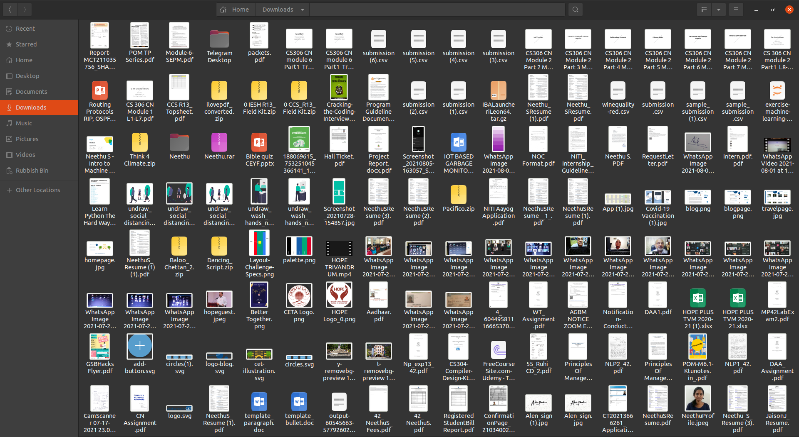
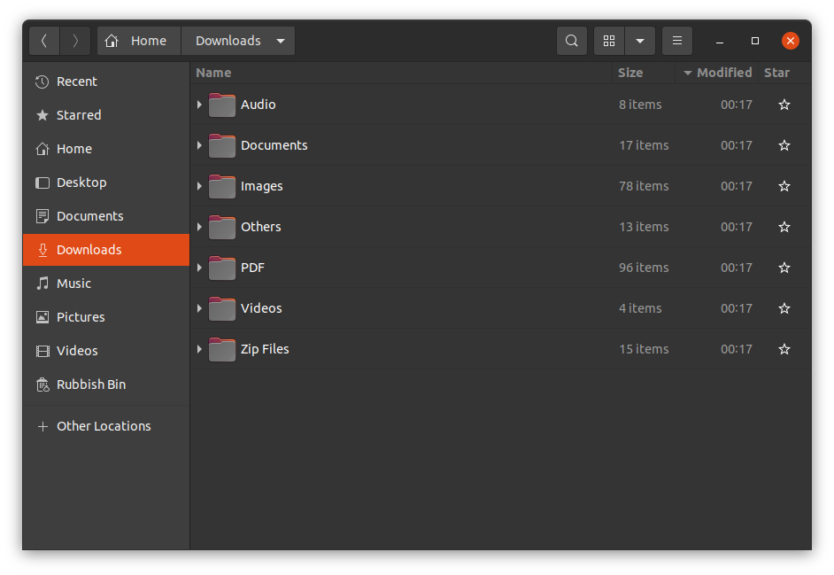

# File-Oraniser
Python script to organise files with respect to their file extensions.

## How-to-use
- Copy the ```file_organiser.py``` to the folder to be organised 
- Run the program ```python file_organiser.py```

## Output
Tried the program on the "Dowloads" folder.

Before organising:


After organising:


